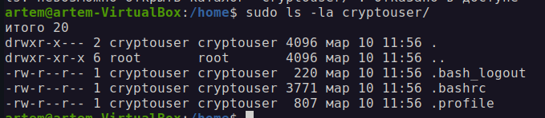
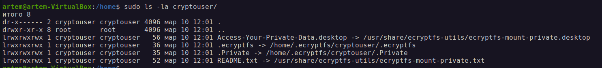
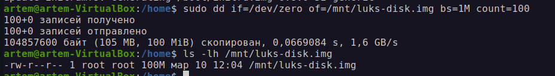
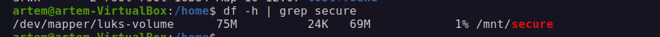

# Домашнее задание к занятию  «Защита хоста»

------

### Задание 1

1. Установите **eCryptfs**.
2. Добавьте пользователя cryptouser.
3. Зашифруйте домашний каталог пользователя с помощью eCryptfs.

*В качестве ответа  пришлите снимки экрана домашнего каталога пользователя с исходными и зашифрованными данными.*  

### Решение:

sudo apt install ecryptfs-utils
sudo adduser cryptouser
ecryptfs-migrate-home -u cryptouser
До шифрования:

После шифрования:

### Задание 2

1. Установите поддержку **LUKS**.
2. Создайте небольшой раздел, например, 100 Мб.
3. Зашифруйте созданный раздел с помощью LUKS.

*В качестве ответа пришлите снимки экрана с поэтапным выполнением задания.*

### Решение:

1. sudo apt install -y cryptsetup
2. sudo dd if=/dev/zero of=/mnt/luks-disk.img bs=1M count=100
3. ls -lh /mnt/luks-disk.img

4. 1sudo cryptsetup luksFormat /mnt/luks-disk.img
5. sudo cryptsetup luksOpen /mnt/luks-disk.img luks-volume
6. sudo mkfs.ext4 /dev/mapper/luks-volume
7. sudo mkdir /mnt/secure
8. df -h | grep secure

